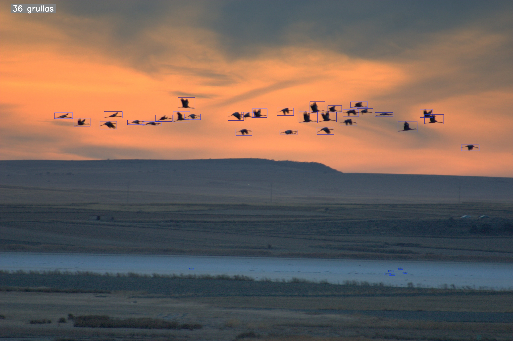
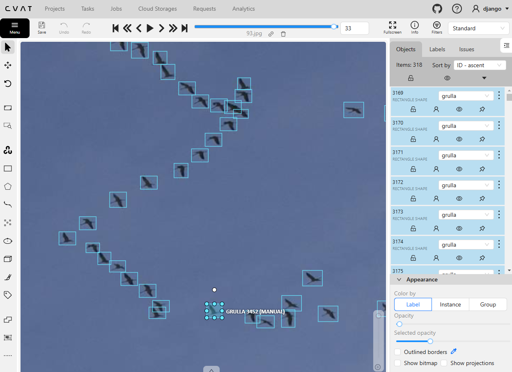
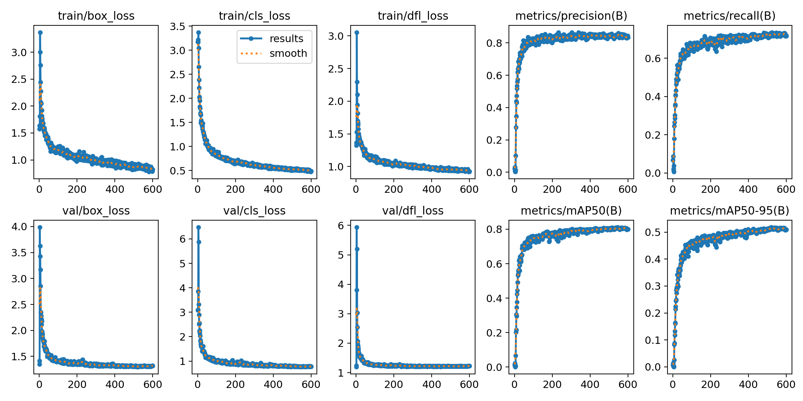

**GalloConta** is a computer vision tool that counts common cranes (*Grus grus*) from a photo, aiding researchers and conservationists in tracking the species with greater efficiency and accuracy.

It was born on the shores of the Gallocanta Lake, in Aragón, Spain — one of the country's most important bird sanctuaries and a critical stop for cranes during their migration.



## Contents

- [Dataset](#dataset)
- [Model](#model)
- [Development](#development)
- [Local deployment](#local-deployment)
- [Configuration](#configuration)
- [Architecture](#architecture)
- [API Endpoints](#api-endpoints)
- [User Interface](#user-interface)
- [Video inference](#video-inference)
- [License](#license)
- [Acknowledgements](#acknowledgements)

## Dataset

> This section, and [Model](#model) below, describe **GRULLA**: the crane-detection model that
> powers the free, publicly-hosted **GalloConta Community** instance at
> [galloconta.app](https://galloconta.app). The backend can load any Kaggle Hub model via the
> `MODEL_NAME` variable (see [Configuration](#configuration)) — GRULLA is just the one this repo
> ships with by default, not the only one it can run.

The dataset consists of 165 images of crane flocks donated by local nature photographers. The images, each 2048x2048 pixels, are split into three subsets:  
- **113 training images**
- **33 validation images**
- **19 test images**

Annotations were made using **[CVAT](https://github.com/cvat-ai/cvat)**, a tool that simplifies the image labeling process.



### How to use CVAT:
If you want to explore CVAT, you can follow the installation guide here:  
[Installing CVAT on Windows](https://github.com/kamipakistan/Installing-CVAT-on-Windows)

## Model

The GalloConta Community deployment uses our **GRULLA** model, based on the YOLOv11 architecture, for detecting and counting cranes. YOLO is an advanced object detection model known for its accuracy and speed in real-time applications.

### Model Training:
Here is the code used for training the model:

```python
from ultralytics import YOLO
import os

data_dir = '/dataset'
output_dir = '/model'

model = YOLO('yolo11n.pt')

model.train(
    data=f"{data_dir}/dataset.yaml",
    epochs=600,            
    imgsz=2048,            
    batch=6,             
    save=True,            
    warmup_epochs=0,
    project=output_dir,
    name='grulla',
    exist_ok=True,
)

```

### Training Results:
The model’s training performance, including metrics, is detailed below:

```
Ultralytics 8.3.65 🚀 Python-3.11.11 torch-2.5.1+cu121 CUDA:0 (NVIDIA A100-SXM4-40GB, 40514MiB)

                 Class     Images  Instances          P          R      mAP50   mAP50-95

                   all         33       3524      0.846      0.723       0.81      0.529
```



### Test Metrics:
The model’s performance on the test subset is shown in the metrics below:

```
Ultralytics 8.3.65 🚀 Python-3.11.11 torch-2.5.1+cu121 CUDA:0 (NVIDIA A100-SXM4-40GB, 40514MiB)

                 Class     Images  Instances          P          R      mAP50   mAP50-95

                   all         19       2103      0.936      0.831       0.89      0.666
```


## Development

Runs both pieces with hot-reload, for actively working on the code.

### Backend (Docker)

1. Copy the env template and fill in your own values:

   ```bash
   cp deploy/.env.example deploy/.env
   ```

   At minimum, set `KAGGLE_USERNAME`/`KAGGLE_KEY` (get them from
   https://www.kaggle.com/settings/account → API → Create New Token) and pick your own
   `BASIC_AUTH_USER`/`BASIC_AUTH_PASS` (protects the `/update` endpoint — don't leave these blank).
   Everything else in `deploy/.env` is optional; see [Configuration](#configuration) for the full list
   (which model to load, allowed frontend origins, optional feedback upload to an external platform).

2. Start the backend — `docker compose` picks up `deploy/.env` automatically because it's run from
   that same directory:

   ```bash
   cd deploy
   docker compose -f docker-compose.local.yml up --build
   ```

   The API is now available at http://localhost:8000 (Swagger UI at `/docs`, ReDoc at `/redoc`).

### Frontend (pnpm)

1. Copy the env template:

   ```bash
   cd frontend
   cp .env.example .env.local
   ```

   `.env.local` is read automatically by Next.js and is already gitignored. Set
   `NEXT_PUBLIC_BACKEND_URL=http://localhost:8000` to point it at the backend from step above.

2. Install and run:

   ```bash
   pnpm install
   pnpm dev
   ```

   The frontend is now available at http://localhost:3000.

## Local deployment

This runs both pieces the way they run in production — built artifacts, no hot-reload — entirely on
your own machine. Useful to try a self-hosted setup (your own model, your own domain) before putting
it on real hardware. Do the `deploy/.env` / `frontend/.env.local` setup from [Development](#development)
first if you haven't already.

### Backend

Build the image (build context is the repo root, since the Dockerfile also needs `requirements.txt`)
and run it with the same `deploy/.env` file from above:

```bash
docker build -f backend/Dockerfile -t galloconta-backend .
docker run -p 8000:8000 --env-file deploy/.env galloconta-backend
```

The API is now available at http://localhost:8000, serving whichever model `MODEL_NAME` points to
(the public GRULLA one, if you didn't set `MODEL_NAME` in `deploy/.env`).

### Frontend

The frontend builds to a static export (`output: 'export'`) — no Node server needed to run it, any
static file server will do:

```bash
cd frontend
pnpm install
pnpm build
npx serve out
```

`NEXT_PUBLIC_BACKEND_URL` (from `frontend/.env.local`) is baked in at build time — point it at the
backend you just started, or at someone else's hosted instance, before running `pnpm build`.

## Configuration

Everything that changes between a deployment — which model to serve, which frontends may call the
API, whether to feed feedback into an external platform — is an environment variable. There's no
license-key check in the code: what you get to run is whatever configuration values you set.

### Backend

| Variable | Default | Description |
|----------|---------|--------------|
| `MODEL_NAME` | `rminguell/grulla/pyTorch/default` | Kaggle Hub model slug to download and serve. Point this at your own trained model to run something other than the public GRULLA one. |
| `CORS_ORIGINS` | `galloconta.app`, `www.galloconta.app`, `dev.galloconta.app`, `localhost:3000`, `localhost:3001` | Comma-separated list of frontend origins allowed to call this backend. |
| `KAGGLE_USERNAME` / `KAGGLE_KEY` | — | Credentials to download the model from Kaggle Hub. |
| `BASIC_AUTH_USER` / `BASIC_AUTH_PASS` | — (required) | Credentials for the protected `/update` endpoint (re-downloads the model). No code-level default — pick your own. |
| `PLATFORM_API_URL` / `PLATFORM_API_TOKEN` | — (optional) | Only needed if you want negative feedback images uploaded to an external platform (e.g. to grow a training dataset). Feedback submission still works without these — the upload is just skipped. |
| `DEFAULT_CONF` / `DEFAULT_IOU` / `IMAGE_SIZE` / `MAX_DETECTION` | `0.17` / `0.3` / `2048` / `5000` | Inference defaults. |

### Frontend (build time)

| Variable | Description |
|----------|--------------|
| `NEXT_PUBLIC_BACKEND_URL` | Base URL of the backend this UI talks to. The single most important variable if you're pointing the frontend at someone else's hosted inference instead of your own. |
| `NEXT_PUBLIC_MAX_UPLOAD_MB` | Client-side upload size limit. |

## Architecture
The backend is built with [FastAPI](https://fastapi.tiangolo.com/), a modern, high-performance web framework for building APIs with Python. It is deployed on Google Cloud Run, enabling fast, scalable, and serverless execution.

The frontend (Next.js, in `frontend/`) is built as a static export (`output: 'export'`) and served as a plain static site behind a CDN — no Node server involved in production. All API calls happen client-side against the Cloud Run backend, so any static host works.

## API Endpoints
The app provides three real-time endpoints:

**/upload** – Users can upload images to receive crane counting predictions.

**/feedback** – Users can submit feedback on the accuracy of the predictions.

**/update** – The model can be updated automatically from Kaggle, integrating the latest training improvements.

## User Interface
A simple and responsive web interface lives in [`frontend/`](./frontend), built with **Next.js** (App Router) and **next-intl** for English/Spanish support. It allows users to upload images, view predictions with zoom, adjust model parameters, and submit feedback — all connected client-side to the FastAPI backend.

You can try it live at: [galloconta.app](https://galloconta.app)

## Video Inference

Here is the code used for video inference demo:

```python
from ultralytics import YOLO
from ultralytics.solutions import object_counter
import ffmpeg
import cv2

input_path='video.mp4'
output_path='video.avi'
model_path='GRULLA.pt'

probe = ffmpeg.probe(video_path, v='error', select_streams='v:0', show_entries='stream=width,height')
width = probe['streams'][0]['width']
height = probe['streams'][0]['height']

cap = cv2.VideoCapture(input_path)
assert cap.isOpened(), "Error reading video file"
w, h, fps = (int(cap.get(x)) for x in (cv2.CAP_PROP_FRAME_WIDTH, cv2.CAP_PROP_FRAME_HEIGHT, cv2.CAP_PROP_FPS))

region_points = [(100, 0), (100, height)]

video_writer = cv2.VideoWriter(output_path, cv2.VideoWriter_fourcc(*"mp4v"), fps, (w, h))

counter = object_counter.ObjectCounter(
    show=False,
    region=region_points,
    model=model_path,
    show_in=True,
    show_out=True,
    line_width=1,
    conf=0.17,
    iou=0.55
)

while cap.isOpened():
    success, im0 = cap.read()
    if not success:
        print("Video frame is empty or video processing has been successfully completed.")
        break
    im0 = counter.count(im0)
    video_writer.write(im0)

cap.release()
video_writer.release()
cv2.destroyAllWindows()
```

## License

[MIT](./LICENSE) for the source code. The graphic and media assets in this repository (photos,
screenshots, logos — including `img/` and `frontend/public/`) are not covered and are not licensed for
reuse.

## Acknowledgements

Thanks to the photographers who donated images for the dataset:

- [Uge Fuertes Sanz](https://www.instagram.com/ugefuertessanz/)
- [Jaime Díaz García](https://www.instagram.com/jaimemalagafotos)
- [Asociación Amigos de Gallocanta](https://www.instagram.com/amigosgallocanta/)

Want to help grow the dataset yourself? **[lab.galloconta.app](https://lab.galloconta.app)** is our
citizen-science platform — donate crane photos, help annotate images, or just follow along as a
volunteer, no prior experience needed.

