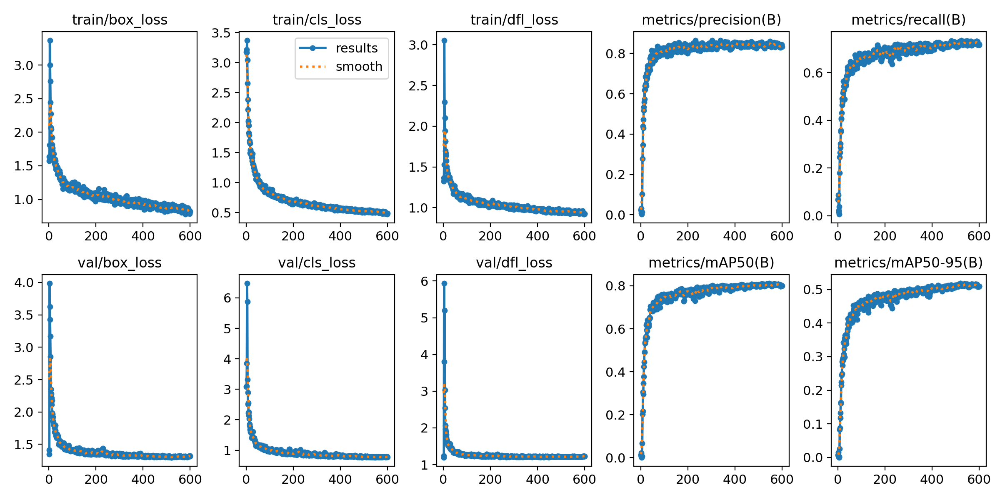

**GalloConta** is a computer vision tool created to monitor the crane population at the Gallocanta Lake.

The lake is one of Spain’s most important bird sanctuaries. It serves as a critical stop for cranes during their migration. 

This app helps automate crane counting, aiding researchers and conservationists in tracking the species with greater efficiency and accuracy.

<br>

<div align="center">
  <a href="https://rminguell.github.io/galloconta/app">
    
  </a>
</div>

<br>


## Contents

- [Dataset](#dataset)
- [Model](#model)
- [Deploy](#deploy)
- [Video inference](#video-inference)
- [Acknowledgements](#acknowledgements)

## Dataset

The dataset consists of 165 images of crane flocks donated by local nature photographers. The images, each 2048x2048 pixels, are split into three subsets:  
- **113 training images**
- **33 validation images**
- **19 test images**

Annotations were made using **[CVAT](https://github.com/cvat-ai/cvat)**, a tool that simplifies the image labeling process.


### How to use CVAT:
If you want to explore CVAT, you can follow the installation guide here:  
[Installing CVAT on Windows](https://github.com/kamipakistan/Installing-CVAT-on-Windows)

## Model

The app uses our **GRULLA** model, based on the YOLOv11 architecture, for detecting and counting cranes. YOLO is an advanced object detection model known for its accuracy and speed in real-time applications.

### Model Training:
Here is the code used for training the model:

```python
from ultralytics import YOLO
import os

data_dir = '/dataset'
output_dir = '/model'

model = YOLO('yolo11n.pt')

model.train(
    data=f"{data_dir}/dataset.yaml",
    epochs=600,            
    imgsz=2048,            
    batch=6,             
    save=True,            
    warmup_epochs=0,
    project=output_dir,
    name='grulla',
    exist_ok=True,
)

```

### Training Results:
The model’s training performance, including metrics, is detailed below:

```
Ultralytics 8.3.65 🚀 Python-3.11.11 torch-2.5.1+cu121 CUDA:0 (NVIDIA A100-SXM4-40GB, 40514MiB)

                 Class     Images  Instances          P          R      mAP50   mAP50-95

                   all         33       3524      0.846      0.723       0.81      0.529
```



### Test Metrics:
The model’s performance on the test subset is shown in the metrics below:

```
Ultralytics 8.3.65 🚀 Python-3.11.11 torch-2.5.1+cu121 CUDA:0 (NVIDIA A100-SXM4-40GB, 40514MiB)

                 Class     Images  Instances          P          R      mAP50   mAP50-95

                   all         19       2103      0.936      0.831       0.89      0.666
```

## Deploy

The app is deployed on **Google Cloud Run**, creating a real-time API endpoint that allows users to upload images and receive crane counting predictions quickly. This cloud-based solution ensures scalability and easy updates.

## Video inference

Here is the code used for video inference:

```python
from ultralytics import YOLO
from ultralytics.solutions import object_counter
import ffmpeg
import cv2

input_path='video.mp4'
output_path='video.avi'
model_path='GRULLA.pt'

probe = ffmpeg.probe(video_path, v='error', select_streams='v:0', show_entries='stream=width,height')
width = probe['streams'][0]['width']
height = probe['streams'][0]['height']

cap = cv2.VideoCapture(input_path)
assert cap.isOpened(), "Error reading video file"
w, h, fps = (int(cap.get(x)) for x in (cv2.CAP_PROP_FRAME_WIDTH, cv2.CAP_PROP_FRAME_HEIGHT, cv2.CAP_PROP_FPS))

region_points = [(100, 0), (100, height)]

video_writer = cv2.VideoWriter(output_path, cv2.VideoWriter_fourcc(*"mp4v"), fps, (w, h))

counter = object_counter.ObjectCounter(
    show=False,
    region=region_points,
    model=model_path,
    show_in=True,
    show_out=True,
    line_width=1,
    conf=0.17,
    iou=0.55
)

while cap.isOpened():
    success, im0 = cap.read()
    if not success:
        print("Video frame is empty or video processing has been successfully completed.")
        break
    im0 = counter.count(im0)
    video_writer.write(im0)

cap.release()
video_writer.release()
cv2.destroyAllWindows()
```

## Acknowledgements

Thanks to the photographers who donated images for the dataset:

- [Uge Fuertes](https://www.instagram.com/ugefuertessanz/)
- [Jaime D García](https://www.instagram.com/jaimemalagafotos)
- [Asociación Amigos de Gallocanta](https://www.instagram.com/amigosgallocanta/)

<br>

<div align="center">
  <a href="https://rminguell.github.io/galloconta/app">
    
  </a>
</div>

<br>
